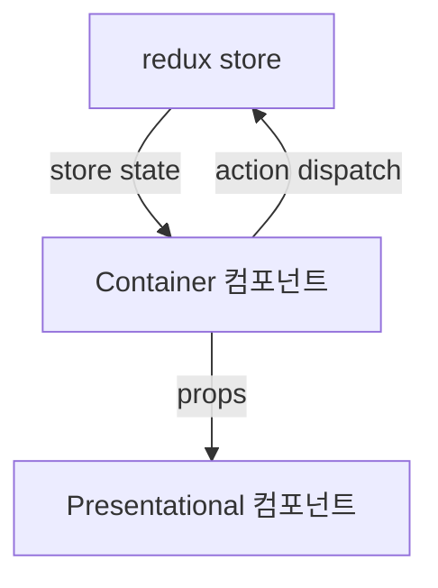

# Presentational 컴포넌트
: UI를 보여주는 컴포넌트
- View 당담(DOM 요소, 스타일)
- 상태 관리 필요 없음
- props로 데이터를 받아오기만 가능
- src/components
# Container 컴포넌트
: redux와 연동되어 있는 컴포넌트
- redux로부터 state를 받아옴
- redux store에 action을 dispatch 함
- src/containers